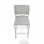
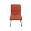
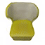
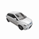
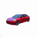
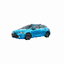

# pixelNeRF for Computational Photography, Spring 2023

Topic: **NeRF for Sparse Views**

*Yuxuan Kuang* and *Shaofan Sun*

     

[Original README](./README_original.md)

**Warning: this is not an official product but only a confirmatory repo to realize our ideas. For reproducing our work, you should follow the environment setup of pixelNeRF and install [CLIP](https://github.com/openai/CLIP).**

## Changes

- Add `eval/eval_camera.py` to test the correspondence of image quality with camera poses.
- Reconstruct `eval/eval_real.py` to better evaluate images on real scenes. (Turn original script into `eval/eval_real_original.py`).
- Take our own photos at `my_input/` and test them with `eval/eval_real.py`, output is at `my_output/`.
- Add `eval/process.sh` script to convert `.mp4` files into **high quality** `.gif` files.

## Improvement

- Add `src/camera/` to add some search utils and loss functions, including using VGG-16 to measure visual loss and using CLIP to measure image feature similarities.
- Figure out that `radius` is crucial to the image quality and implement a searching algorithm for a good `radius` to improve the render quality.
- Re-implement original inference code for single-view 3D reconstruction, fast and reliable!

## How to Run

For example, to test the images of chairs in `my_input/` with `sn64` model, run:

```shell
python eval/eval_real.py \
    -n sn64 --gpu_id 0 \ # load pretrained model
    -I my_input -O my_output \ # input and output directories
    --size 64 --out_size 64 \ # input and output image size
    --radius_m 2 --radius_M 5 --spacing 0.3 # search range and step size
```

If you want to specify a radius, add `--radius <radius>`. If you want to specify an image file to process (and ignore `-I`), add `-f <filename>`. If you want to save rendered image frames, add `--with_frame`.

When you switch to different categories, you need to change the arguments above. For better rendering effect, you may also change `--z_near`, `--z_far`, `--focal` and `--elevation`.

For other arguments, see `eval/eval_real.py` and [original README](./README_original.md).

## Report

See [report.md](readme-img/report.md).

## Division of Labor

*Yuxuan Kuang*: code implementation, experiment design, report writing

*Shaofan Sun*: data collection, data processing, report writing