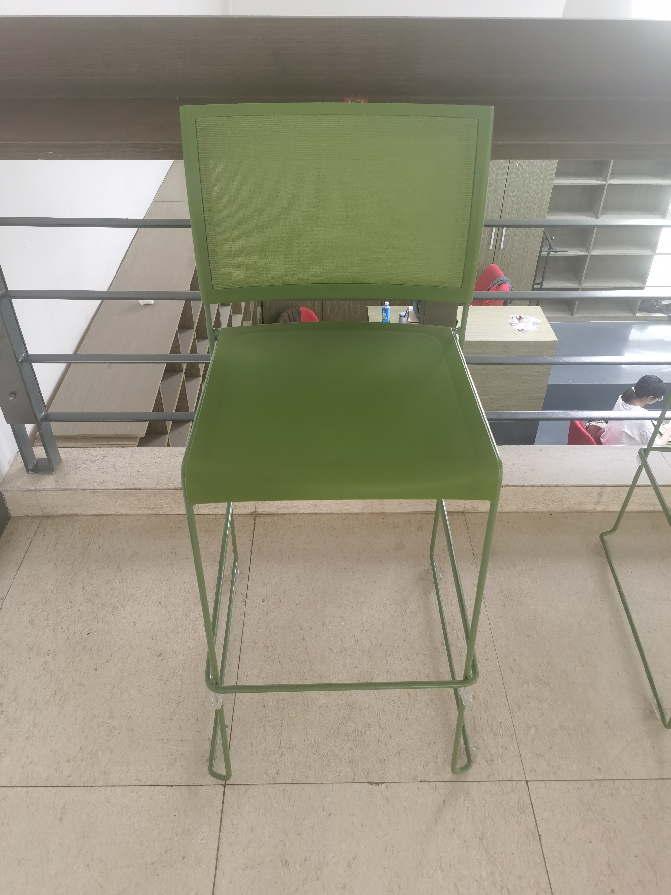

# 计算摄像学期末大作业报告

主题：NeRF for Sparse Views

匡宇轩 孙少凡

源代码地址：https://github.com/yxKryptonite/pixel-nerf

## 1. 背景

期中，我们调研了 NeRF for Sparse Views 的相关内容，我系统地调研了稀疏视角 NeRF 的各个工作，并将它们进行了分类。我们的动机是，NeRF 虽然可以高效的对场景或物体进行三维重建，但往往需要大量的视角 (上百个) 进行训练，其实质是对一个场景/物体进行过拟合，然而在现实中，我们往往不能获得如此多的视角，而只有稀疏的视角，此外，大量视角的过拟合导致 NeRF 的训练时间过长。因此我们希望能够找到一个可以借助稀疏视角，甚至单一视角进行三维 NeRF 重建的方法。

此外，NeRF 的困难除了需要大量视角，还在于对于每个视角需要一个较为准确的相机位姿。然而，现实中，我们用手机拍照往往并不能获取准确的相机位姿，况且互联网上存在大量的无标注单视角图片，因此对它们进行三维重建十分困难。因此我们还希望可以找到一种免除准确相机位姿的方法。

## 2. 相关工作简介

以下是一些相关工作的简单介绍，具体内容详见论文。

### 2.1 [NeRF](https://arxiv.org/abs/2003.08934)

NeRF 将场景用神经辐射场的形式进行表征，输入场景的三维坐标和给定视角，输出该视角下渲染的 RGB 值和透明度 $\sigma$，并通过volume rendering 将该视角的图片渲染出来。通过使用该视角下的真实图片进行监督，来最小化渲染图片与真实图片的像素差异，从而训练出一个可以渲染该场景的神经辐射场。

### 2.2 [pixelNeRF](https://arxiv.org/abs/2012.02190)

这是我们所选中的论文，我们的代码也基于他们的开源代码。这篇论文提出了一种可泛化的神经辐射场重建方法，即将图片使用卷积神经网络进行编码，给定坐标和视角，通过 image feature 的查询，来获取该坐标和视角下的 RGB 值和透明度 $\sigma$。这样，经过大量不同场景的数据训练，模型可以学习到场景的几何先验 (prior)，从而可以泛化到新的场景上。由于其泛化性，pixelNeRF 不需要对一个场景进行过拟合，而可以通过预训练，对新场景进行 forward-manner reconstruction，且在稀疏视角，甚至单一视角下表现优异。

### 2.3 [CLIP](https://arxiv.org/abs/2103.00020)

CLIP 是 OpenAI 在2021年提出的多模态预训练模型。其通过对互联网上的海量文本-图片对进行对比学习，学习到了图片和文本的语义对应关系，并开放了两个极其强大的预训练编码器，可以将图像和文本编码成一个512维向量。向量之间的余弦相似度可以用来衡量图-图、图-文、文-文的语义相似度。

### 2.4 [DietNeRF](https://arxiv.org/abs/2104.00677)

这篇工作借助 CLIP，为 NeRF 添加了一个额外的损失函数 —— semantic consistency loss，这个损失函数通过计算新视角下渲染的图片和真实图片的 CLIP feature similarity，来监督 NeRF 渲染的语义一致性。文章指出，"A bulldozer is a bulldozer from any perspective." 意思是一个物体在不同的视角下渲染，尽管像素差异会很大，但其语义仍是相似的，因此使用 CLIP 编码后，它们的相似度也会较高。实验证明，增添了这个损失后，模型的渲染质量更高。

此外，DietNeRF 还对此前的 pixelNeRF 进行了微调，通过加入 semantic consistency loss，实验证明新的 DietPixelNeRF 渲染质量会更高。但我们并没有选择这篇工作，原因之一是他们并没有 release 相应的预训练模型，其二是他们与我们想做的改进并不相同。

## 3. 我们所做的修改

此处只涉及我们对 pixelNeRF 原仓库代码结构和代码功能的修改，不包含我们对推理过程的改进和提升（具体请见下一部分）。

- 我们增加了一个临时脚本 `eval/eval_camera.py` 来检验单张输入的情况下，相机位姿和渲染质量的关系，现已弃用。
- 由于原有代码参数设置和推理逻辑的种种问题，我们重构了 `eval/eval_real.py` 脚本用于对我们拍摄的真实数据进行推理，并将原来的代码重命名为 `eval/eval_real_original.py`。
- 我们根据数据集的图片中物体的画面占比以及角度，用相似的相机位姿从二教、理教拍摄了许多椅子的真实图片，以及从路边拍了一些汽车的真实图片，使用作者提供的预训练模型对它们进行推理。换言之，代码跑通了。真实图片样例如下图所示:
  
- 我们用编写了一个脚本用于将 `.mp4` 文件转为**高质量**的 `.gif` 文件。（直接 ffmpe有许多噪点）

## 4. 我们所做的提升

### 4.1 思路

我们的思路是，如果我们不知道准确相机位姿，而只有一张图片，如何进行高质量的重建？源代码中的做法是提供了一个 dummy camera:

$$
\begin{bmatrix}
1 & 0 & 0 & 0 \\
0 & 1 & 0 & 0 \\
0 & 0 & 1 & 2.6 \\
0 & 0 & 0 & 1
\end{bmatrix}
$$

其旋转矩阵为 $3 \times 3$ 单位矩阵，平移向量为 $[0,0,2.6]$。然而对于不同的场景，这个 dummy camera 并不一定适用，因此我们希望可以通过一张图片，来估计出一个合理的相机位姿（不一定精确），从而进行合理的重建，即肉眼可见没有大的 artifact 即可。

我们经过实验发现，对于单张图片，由于单张图片位姿的相对性，旋转矩阵的变化并不会对渲染质量产生影响，因为最坏的结果不过是渲染是角度发生错误，可以进行人工的修正。然而，如果平移向量不准确，可能渲染后的画面中就是一片空白，这是我们不希望看到的。因此，我们的目标就是，估计一个合理的平移向量。为了让问题更加简化，我们沿用 dummy camera, 令 $t=[0,0,r]$，也就是说，我们只需要估计 $r$ 即可。

我们将 $r$ 在某一个范围内进行遍历枚举，然后对每一个 $r$，都进行渲染，然后使用 CLIP 编码后的 feature similarity 作为评价指标，选取最优的 $r$ 作为最终的结果。

### 4.2 具体代码修改

- 增加了 `src/camera/`，添加了一些搜索函数和使用 VGG-16 (虽然最后没用上) 和 CLIP 进行评价的函数。
- 在 `eval/eval_real.py` 中实现了对 $r$ 进行搜索和评价的逻辑。
- 实现了一套简单易用模型推理逻辑，快速、准确！

具体代码使用，详见我们仓库的 [README](https://github.com/yxKryptonite/pixel-nerf/blob/master/README.md)。

## 5. 实验结果及分析

## 6. 小组分工

匡宇轩：代码实现、实验设计、报告撰写

孙少凡：数据收集、数据处理、报告撰写

## 7. 总结

在这个项目中，我们通过改进 pixelNeRF，实现了给定单张图片，对图片中的物体进行三维重建的功能。我们的改进主要是在推理过程中，通过对相机位姿的搜索，来提升渲染质量。我们的实验结果表明，我们的改进可以在不知道相机位姿的情况下，对物体进行较好的重建。

当然，我们的项目也存在一些局限性和不足之处。例如，我们只粗糙的限定了 $r$ 的范围和搜索步长，然后进行枚举，这不够智能。或许我们也可以尝试利用梯度下降，甚至使用一些简单的网络来预测对应的 $r$。此外，除了 $r$ 之外，还有一些其他的参数也对渲染质量有影响，比如相机焦距、渲染光线的范围等等，而我们并没有对它们进行建模。希望我们可以在未来更进一步，对这些问题进行探索。

总之，在这个项目中，我们学到了许多，也通过动手实践、在真实场景、真实照片中使用模型验证我们的想法，加深了我们对计算摄像学和神经辐射场的理解，收获颇丰。

